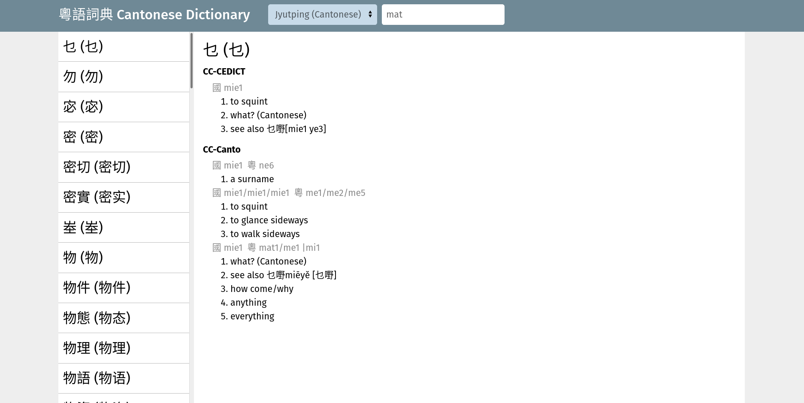

# Dictionary

This is a Cantonese/Mandarin dictionary as a web application.

* The backend is in rust with actix-web and diesel (in `web`)
* The frontend is in Vue (in `frontend`)
* The database is in the SQLite format
* A parser for a modified CC-CEDICT format (_with | as a separator for the definitions, not /_). (Note, the CC-CEDICT file
  can be preprocessed by replacing all ' / ' (surounded with spaces) with '/' (not surrounded with spaces)
  and replacing all other '/' with '|'.)

# Screenshot

